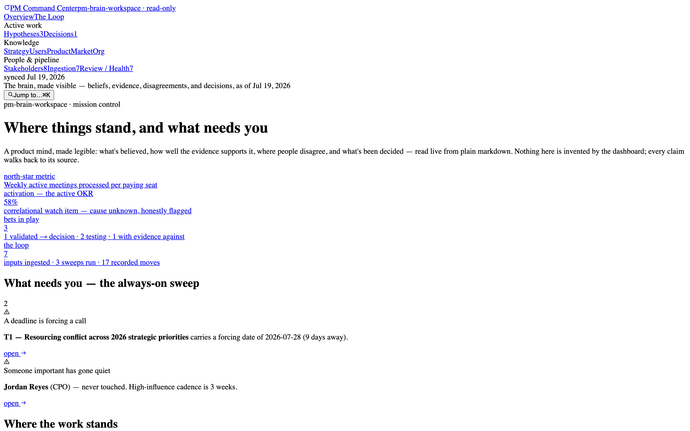

# PM Command Center

A dashboard for a [PM Brain](https://github.com/phuryn/pm-brain) — a product manager's
strategy, hypotheses, decisions, and user evidence, kept as plain markdown files in a
folder. The dashboard reads that folder and lays the whole picture out on one screen, so
you can see the state of your thinking at a glance instead of opening files one at a time.



> **Demo data disclosure:** the workspace shown everywhere here — "Flo," its customers,
> metrics, and stakeholders — is **fictional**, built to demonstrate the system in
> realistic use. No real company or customer data appears in this repo. The dashboard
> itself is workspace-agnostic: point it at any PM Brain folder and it renders that.

## The problem

PM Brain keeps everything as text on purpose: your strategy, hypotheses, decision
records, and interview evidence live as markdown in a git repo, and you operate on them
through Claude Code commands. That's the right storage model — everything is inspectable,
versioned, and free of vendor lock-in — but it has no screen of its own. Reading the
*state of your own thinking* means opening directories one by one and checking your
memory against index files. And the system is always in motion: new input comes in, gets
synthesized, ripples out to the files it affects, gets tagged, and is swept for problems
each week — none of which a plain folder shows you.

## What it does

Each view below answers a question a folder of files can't.

- **Shows the work cycle at a glance.** PM Brain runs on a repeating five-stage cycle —
  take in a new input, synthesize it, push the result out to the files it changes, tag
  it, and sweep for problems. A dedicated view shows all five stages with live counts,
  and lets you follow any single input through the whole cycle: the word-for-word
  source → the synthesized record → every file it actually changed, each step a real
  link you can click.
- **Traces every claim back to its source.** Each piece of evidence carries a small label
  showing where it came from (a synthesized record / a raw source / heard in conversation
  / the PM's own read / general industry knowledge / a chat with no written record /
  **untagged**). Click the label, land on the source, and see who else relies on it.
- **Keeps disagreement visible.** Evidence for and evidence against sit side by side;
  genuine contradictions stay shown as two sides; an explanation that was ruled out stays
  on the page along with the condition that would put it back in play, so it isn't
  re-argued from scratch.
- **Surfaces what would change a decision.** Every decision record shows "what would
  reverse this" as its own panel, including any date by which the call has to be made —
  and captures the in-between cases too, like a decision that's been made but is still
  blocked, in the record's own words.
- **Watches for problems continuously.** Every week, PM Brain runs a health sweep; the
  dashboard re-runs those same checks on every page load — notes going stale, decisions
  left open too long, key relationships going quiet, broken internal links, claims with
  no source label, and indexes that no longer match their files. When an index disagrees
  with the actual files, the dashboard *shows* the mismatch rather than quietly fixing
  it — the same principle the brain itself follows.
- **Looks right whether the folder is full or nearly empty.** An empty area answers three
  questions: what belongs here, why it's empty right now, and the command that fills it. A
  link pointing to a file that doesn't exist yet is shown as exactly that.

More screens: [the loop](docs/media/loop.png) ·
[hypothesis detail](docs/media/hypothesis-detail.png) ·
[decision record](docs/media/decision-detail.png) ·
[stakeholder grid](docs/media/stakeholders.png)

## Quick start

```bash
npm install
npm run dev
```

That runs against the committed demo snapshot in `data/`. To point it at your own
PM Brain workspace instead:

```bash
echo 'BRAIN_DIR=../your-pm-brain-workspace' > .env.local
npm run dev
```

In `BRAIN_DIR` mode reads are live — run `/ingest` or `/review` in your workspace,
refresh, and watch the surfaces update. Deploys never read live: `npm run sync-data`
copies the workspace into `data/` as a deliberate, committed snapshot, and all relative
times on the deployed site anchor to that sync date.

## How it reads the files

No frontmatter, no sidecar database, no changes to the workspace. The parser
(`src/lib/brain/`) reads the brain's own conventions from markdown structure: schema
sections, status lines, the six source-label (provenance) formats it recognizes
(including backtick-wrapped and bare-bracket citations), and relative links. From those
it derives the link/backlink graph, a dated event stream (ingests, promotions, decisions,
sweeps), and the health findings. Anything it can't parse structurally still renders as
prose through a universal file viewer, so no file in the workspace is unreachable.

## Decisions & tradeoffs

- **Files are the source of truth, not INDEXes.** The original plan was to parse
  `INDEX.md` tables. On contact with real data, only one area actually keeps a table —
  and the workspace's own history shows INDEX entries drifting from files. So the parser
  reads the files and *renders* INDEX drift as a health finding. Tradeoff: more parser
  surface to maintain, in exchange for never presenting stale rosters as truth.
- **The event stream is derived from dated facts in files, not git.** Git history would
  give richer ordering, but it isn't available on a deployed snapshot and not every
  workspace has clean history. Filename dates + promotion/decision/sweep dates cover the
  need with zero dependencies. I'd revisit git enrichment if per-file diffs become worth
  showing.
- **The dashboard never computes a verdict.** Chips are typed by *source*, confidence
  comes only from the files, and a correlational watch item stays labeled correlational.
  It would be easy to score "evidence strength" — and it would break the system's core
  contract that the human sees the inputs, not an opinion laundered through a UI.
- **Read-only in Phase 1, on purpose.** Acting on the brain (running commands from the
  dashboard) is planned as localhost-only Phase 2 ([PHASE-2-PLAN.md](PHASE-2-PLAN.md)) —
  execution never ships to the public deploy.

## Built vs. planned

| | Status |
|---|---|
| All read surfaces: overview, loop, hypotheses, decisions, stakeholders, knowledge areas, ingestion feed, review/health, artifact viewer | **Built** |
| Source labels, click-through audit trail, backlinks, contested evidence, reversal conditions, always-on health checks, event stream | **Built** |
| Empty-state handling for sparse/greenfield workspaces | **Built** |
| ⌘K jump (titles/names only) | **Built** — basic by design |
| Command execution from the dashboard (`/review`, `/ingest`, …) — localhost-only, shells out to the `claude` CLI, command-agnostic | **Planned** — [PHASE-2-PLAN.md](PHASE-2-PLAN.md) |
| Full-text search, git-derived timeline, mobile nav | Not planned for now — see [implementation-notes.md](implementation-notes.md) |

## Known limits

- Desktop-first: content grids collapse responsively, but the sidebar doesn't yet.
- Search is jump-to-anything by title/name — no full-text, no filters.
- The public deploy is a frozen snapshot; it only changes when `sync-data` is run and
  committed, which is a feature, but means the demo isn't "live" in the streaming sense.

## Stack & credits

Next.js (App Router) · Tailwind v4 · Radix primitives + cmdk · unified/remark ·
Geist. Visual language follows [Linear](https://linear.app)'s dark design system.
Built on top of [PM Brain OS](https://github.com/phuryn/pm-brain) by Paweł Huryn (MIT) —
the dashboard is a companion viewer, not a fork; it never modifies a workspace.

MIT — see [LICENSE](LICENSE).
